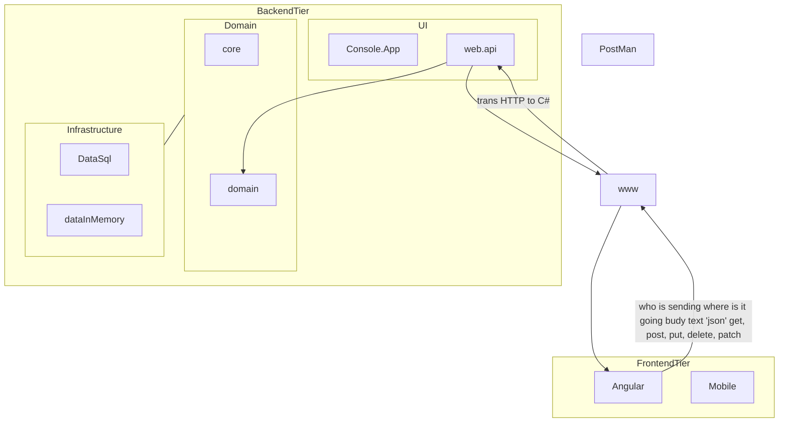

# Rest API

## Creat a rest api



- Read - Get(no text body : always only read data , not to send data.)
- Update - Put - patch(part of update)


## Json

- Make the object as string in an array

```json
[{
    "data":00,"name":fei
}]
```


## Test it by PostMan

## CRUD


# 
